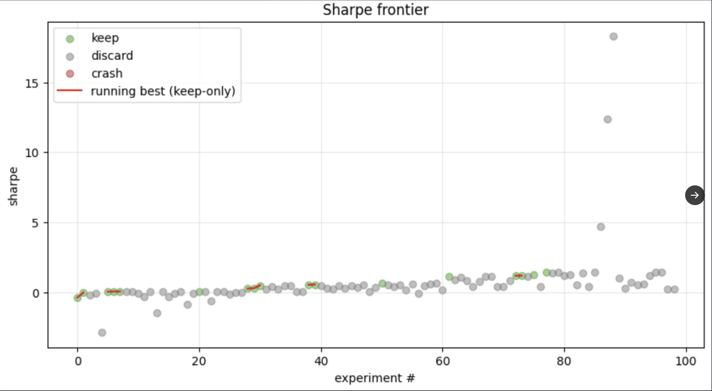

# Auto-Quant

> LLM-native autonomous quant research loop. Karpathy's
> [autoresearch](https://github.com/karpathy/autoresearch) pattern applied to
> FreqTrade strategies on BTC/USDT + ETH/USDT @ 1h.

The idea: give an LLM agent a FreqTrade backtest harness and a single strategy
file. The agent modifies the strategy, runs a backtest, checks if the result
improved, keeps or discards, and repeats. Over many iterations the hope is to
observe which patterns the LLM actually finds useful on this asset pair. The
**loop lives in `program.md`** — not in any orchestrator — and is executed by
whatever LLM agent you point at the repo.

This is a prototype to validate whether Karpathy's autoresearch pattern
transfers to quant research. The success metric is "did the loop run and
produce an interpretable `results.tsv`", **not** "did we find a profitable
strategy". Nothing in this repo is a recommendation to trade real capital.

## A run in one picture



One dot per backtest over 99 experiments on BTC/USDT + ETH/USDT @ 1h. Green
dots were kept by the agent, gray were discarded. The red line is the
running best of *kept only* — it plateaus at Sharpe 1.44, **not** at the
Sharpe-18 cluster on the right. Those high-Sharpe runs are gray because the
agent itself identified them as oracle-gaming (ROI-clipping that compressed
return variance without improving real return) and retroactively discarded
them. Full write-up in
[`versions/0.1.0/retrospective.md`](versions/0.1.0/retrospective.md).

## How it works

Four things that matter:

- **`config.json`** — FreqTrade config, fixed. Pairs, timeframe, fees, dry-run
  wallet, timerange. The agent does not touch this.
- **`prepare.py`** — one-time data download from Binance via FreqTrade's Python
  API. The agent does not touch this.
- **`run.py`** — in-process **batch backtest**. Discovers every `.py` under
  `user_data/strategies/` (skipping files prefixed `_`), runs FreqTrade's
  `Backtesting` for each, and prints one `---` summary block per strategy.
  The agent does not touch this.
- **`user_data/strategies/`** — **the directory the agent owns**. Each `.py`
  is one strategy; up to 3 active at a time. Agent creates / evolves / forks
  / kills strategies here. `_template.py.example` is the skeleton reference.

Plus:

- **`program.md`** — the autonomous-research instructions the human points the
  LLM agent at.
- **`results.tsv`** — event log. Schema: `commit | event | strategy_name | sharpe | max_dd | note`.
  Events: `create | evolve | stable | fork | kill`. Gitignored so it survives
  `git reset --hard` — past lessons stay available even when experimental
  commits get thrown away.
- **`analysis.ipynb`** — post-hoc read: per-strategy trajectories, cap
  utilization, event distribution, note word frequency.

*(v0.1.0 used a single `AutoResearch.py` file that the agent mutated in place.
That mode anchored the agent on one paradigm for all 99 rounds. v0.2.0
switched to multi-strategy; v0.1.0 is archived under [`versions/0.1.0/`](versions/0.1.0/)
with a full [retrospective](versions/0.1.0/retrospective.md).)*

## Requirements

- Python 3.11+
- [uv](https://docs.astral.sh/uv/)
- TA-Lib (the C library — installed separately from the Python binding)

## Install

```bash
# 1. Install uv if you don't have it
curl -LsSf https://astral.sh/uv/install.sh | sh

# 2. Install the TA-Lib C library
#    macOS:  brew install ta-lib
#    Linux:  see https://github.com/mrjbq7/ta-lib#dependencies
#    If native install is painful on your platform, the FreqTrade Docker
#    image ships with TA-Lib pre-built and works as an alternate runtime.

# 3. Install Python deps
uv sync

# 4. One-time data download (~a few minutes)
uv run prepare.py

# 5. Sanity check — with no strategies yet, run.py should report
#    "no strategies found" and exit. That's expected — the agent creates
#    1-3 starting strategies during setup before the first real backtest.
uv run run.py > run.log 2>&1; echo "exit=$?"
```

If step 5 prints `no strategies found...` and `exit=2`, you're ready. (An
actual backtest run only starts once the agent has created at least one
strategy file.)

## Running the agent

Open a **second** terminal (keep your editor/IDE in the first so the two
sessions don't fight over the working tree), `cd` into the repo, and start
your preferred LLM agent (Claude Code, Codex, Cursor agent, etc.). Then
prompt something like:

> Have a look at `program.md` and let's kick off a new experiment. Let's do
> the setup first.

The agent reads `program.md`, goes through setup, then enters the experiment
loop. It keeps iterating until you interrupt it or it runs out of context.

### Permissions

The loop only works if the agent can run commands without a human approving
each one — it will invoke `uv run run.py`, `git commit`, `git reset`, and
edit the strategy file hundreds of times. How you grant that depends on your
tooling:

- **Claude Code**: prefer a scoped allowlist via a project-level
  `.claude/settings.json`. See the
  [permissions docs](https://docs.claude.com/en/docs/claude-code/settings#permissions)
  for patterns like `Bash(uv run *)` and `Bash(git commit:*)`.
- **Other agents**: most have an equivalent — a config flag or settings file
  to mark specific commands or tools as pre-approved.

Read the docs and choose a permission posture you're comfortable with before
leaving a loop running unattended. The agent is pointed at a sandboxed
FreqTrade workspace and has no live-trading access (all `dry_run`), but it
does run arbitrary shell commands and write files inside this directory.

## Project structure

```
Auto-Quant/
├── README.md
├── pyproject.toml                     # uv-managed deps
├── .python-version                    # 3.11
├── config.json                        # FreqTrade config (read-only for agent)
├── prepare.py                         # data download (read-only for agent)
├── run.py                             # backtest + summary (read-only for agent)
├── program.md                         # agent instructions
├── analysis.ipynb                     # post-hoc analysis
├── user_data/
│   ├── strategies/
│   │   ├── _template.py.example       # skeleton the agent copies from
│   │   └── <agent-created files>.py   # up to 3 active at a time
│   ├── data/                          # gitignored — downloaded OHLCV
│   └── backtest_results/              # gitignored — FreqTrade outputs
├── versions/                          # frozen snapshots of past runs
└── results.tsv                        # gitignored — agent's event log
```

## Design notes

- **Agent owns one directory, not one file.** `user_data/strategies/` is its
  workspace; everything else is evaluation contract. Up to 3 strategies
  simultaneously, hard cap. Multi-strategy exists specifically to fight
  the single-paradigm anchoring that v0.1.0 exhibited.
- **No CLI indirection.** The agent only runs `uv run prepare.py` and
  `uv run run.py`. `run.py` uses FreqTrade's `Backtesting` class in-process,
  so startup is fast and errors surface as real Python stack traces.
- **`results.tsv` is a gitignored event log.** Each round, the agent appends
  rows (one per strategy touched, with event type: create/evolve/stable/fork/kill).
  It survives `git reset --hard` so past lessons stay available even when
  experimental commits get thrown away.
- **LLM decides keep/kill, not a scalar rule.** Sharpe on a finite window
  is noisy and gameable. Agent reads the full per-strategy summary blocks
  and decides inline which strategies to evolve, fork, or kill — the
  program.md rules force action but not which action.
- **Stagnation rule.** A strategy can't sit idle for more than 3 consecutive
  stable rounds — agent must evolve, fork, or kill it. With only 3 slots,
  dead weight is expensive.

## License

MIT.
